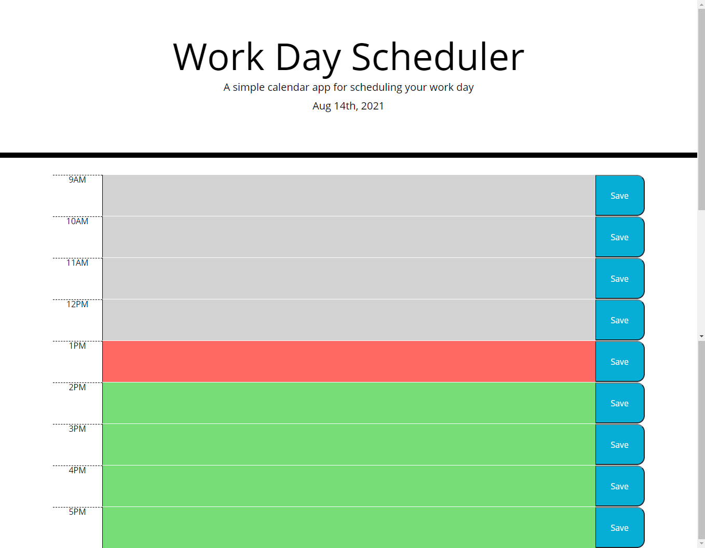

# Day-Planner

## Description

This is a simple scheduler that has an updated date-stamp. It runs from 9am-5pm, updating the color of each time block to correspond to the current hour (gray for past, red for present, and green for future). When the user types a task into a time block, he/she can save that task to the time block. If the user refreshes the page, the time block will have the task still saved to it.

## Screenshots

## Links

https://ccardinale98.github.io/day-planner/

https://github.com/ccardinale98/day-planner